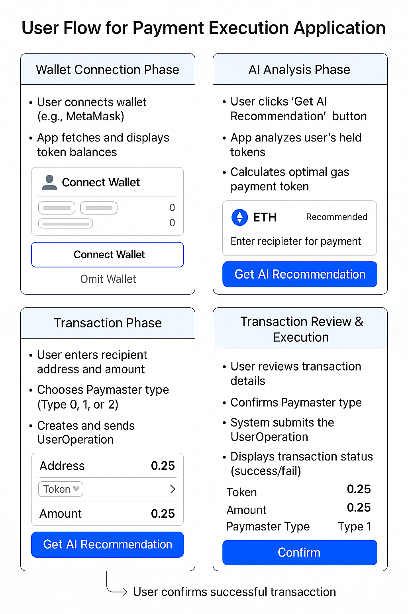

# AI-Powered Payment Execution dApp on NERO Chain

## Project Overview

AI-Powered Payment Execution is a decentralized application (dApp) built on NERO Chain that uses AI to recommend the optimal ERC20 token for gas fee payments. By leveraging NERO Chain's Account Abstraction and Paymaster features, users can pay transaction fees with any supported token instead of requiring the native NERO token.

The project helps solve a common Web3 pain point - the need to hold specific native tokens for gas fees - while delivering a Web2-like user experience through a seamless interface.

### Key Features

- **AI Token Recommendation**: Analyzes user's token balances, price volatility, and slippage to suggest the most cost-effective token for gas payment
- **Account Abstraction Integration**: Uses NERO Chain's UserOp SDK for seamless AA wallet interactions
- **Paymaster Support**: Implements all three payment types:
  - Type 0: Sponsored transactions (free gas)
  - Type 1: Prepay with ERC20 tokens
  - Type 2: Postpay with ERC20 tokens
- **Clean, Intuitive UI**: Simplified workflow that hides blockchain complexity

## User Flow

The application provides a streamlined payment execution process:

1. **Connect Wallet**: User connects their wallet to access the dApp
2. **View Tokens**: The system displays the user's ERC20 token balances
3. **Select Transaction**: User chooses a payment recipient and amount
4. **Smart Token Selection**: The AI component analyzes all available tokens and recommends the optimal one for gas payment
5. **Execute Transaction**: User confirms the transaction with a single click
6. **Transaction Processing**: The system handles all blockchain interactions through Account Abstraction
7. **Confirmation**: User receives confirmation when the transaction is complete



## Technical Architecture

### Backend (Node.js)

The backend provides:

1. **Token Scoring Service**: Implements AI logic to score and rank tokens based on:
   - Token balance (40% weight)
   - Price volatility (30% weight)
   - Slippage (30% weight)

2. **Price Service**: Fetches token prices, volatility, and slippage data from external APIs (in a production environment would connect to CoinGecko, 1inch, etc.)

3. **Paymaster Service**: Interacts with NERO Chain's Paymaster to:
   - Fetch supported tokens
   - Get payment type options
   - Request gas sponsorship or ERC20 payments

4. **API Endpoints**:
   - `/recommend-token`: Returns the best token for gas payment
   - `/supported-tokens`: Lists tokens supported by the Paymaster
   - `/payment-types`: Provides available payment methods
   - `/estimate-gas`: Calculates gas costs for transactions

### Frontend (React)

The frontend provides:

1. **Custom Hooks**:
   - `useWallet`: Manages wallet connection and token fetching
   - `useUserOp`: Builds and sends UserOperations with NERO Chain's SDK
   - `useTokens`: Handles token scoring and recommendation

2. **Key Components**:
   - `WalletConnect`: Manages wallet connection UI
   - `TokenList`: Displays user's tokens with AI recommendation highlights
   - `RecommendationCard`: Shows detailed AI analysis for recommended token
   - `TransactionModal`: Handles transaction confirmation and status

3. **Pages**:
   - `HomePage`: Token selection and recommendation interface
   - `PaymentPage`: Transaction details and execution

## NERO Chain Integration

This payment execution dApp fully utilizes NERO Chain's unique features:

### Account Abstraction

- Implements smart contract wallets for transaction execution
- Provides counterfactual wallet addresses even before deployment
- Handles complex transaction logic in a user-friendly way

### Paymaster System

- Executes transactions with flexible gas payment options
- Supports three payment methods:
  - Type 0: Developer-sponsored transactions (free for users)
  - Type 1: Prepay with ERC20 tokens (user pays upfront)
  - Type 2: Postpay with ERC20 tokens (user pays after execution)

## AI-Powered Token Selection

While the primary function of this dApp is transaction execution, the integrated AI component provides significant value by:

1. Analyzing token data (balances, price, volatility, slippage)
2. Applying weighted scoring algorithm to find the most cost-effective payment option
3. Providing a clear, one-click recommendation that simplifies the payment process

This AI feature eliminates the need for users to make complex decisions about which token to use for gas payments, making blockchain transactions more accessible to mainstream users.

## Setup & Development

### Prerequisites

- Node.js v16+
- Metamask or another Web3 wallet
- NERO Chain testnet connection

### Environment Variables

Backend (`.env`):
```
PORT=3001
NERO_RPC_URL=https://rpc-testnet.nerochain.io
PAYMASTER_URL=https://paymaster-testnet.nerochain.io
PAYMASTER_API_KEY=your_api_key
ENTRYPOINT_ADDRESS=0x5FF137D4b0FDCD49DcA30c7CF57E578a026d2789
```

Frontend (`.env`):
```
REACT_APP_API_BASE_URL=http://localhost:3001/api
REACT_APP_NERO_RPC_URL=https://rpc-testnet.nerochain.io
REACT_APP_BUNDLER_URL=https://bundler-testnet.nerochain.io
REACT_APP_PAYMASTER_URL=https://paymaster-testnet.nerochain.io
REACT_APP_PAYMASTER_API_KEY=your_api_key
REACT_APP_ENTRYPOINT_ADDRESS=0x5FF137D4b0FDCD49DcA30c7CF57E578a026d2789
REACT_APP_ACCOUNT_FACTORY_ADDRESS=0x9406Cc6185a346906296840746125a0E44976454
```

### Installation

1. Clone the repository
2. Install backend dependencies:
   ```
   cd backend
   npm install
   ```
3. Install frontend dependencies:
   ```
   cd frontend
   npm install
   ```

### Running the Application

1. Start the backend:
   ```
   cd backend
   npm run dev
   ```
2. Start the frontend:
   ```
   cd frontend
   npm start
   ```
3. Open http://localhost:3000 in your browser

## Future Roadmap (Wave 2+)

Wave 2: Loyalty & Analytics Layer
Points & Loyalty System: Earn points for each transaction

Real-time portfolio insights

Gas cost tracking by token

AI-powered price trend forecasts

Wave 3: Ecosystem Integration
Cross-chain (multi-chain) token gas support

DEX integration for one-click token swaps before payment

Points-to-token exchange option via on-chain marketplace

Optimization strategies for high-frequency users

Wave 4: Advanced UX & Governance
Subscription-based gas fee sponsorship (e.g., premium tiers)

Customizable gas payment policies

DAO-driven governance for AI weightings (slippage, volatility, etc.)

Expanded loyalty rewards (e.g., gas rebates, NFTs)

## License

MIT
